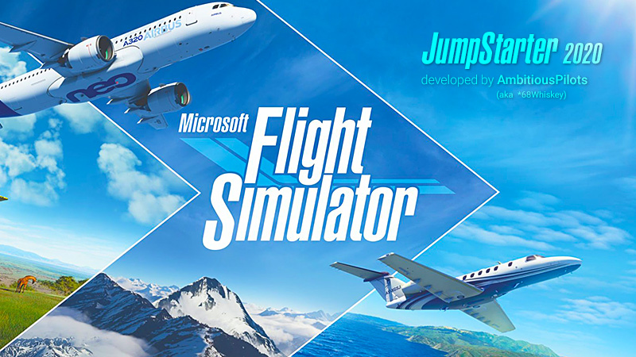

<h1 align="center">FSJumpStarter2020</h1>

Starts Microsoft Flight Simulator without intros and skips to main menu automatically.

  
  
  
  

 

  

 

## About
Tired of staring at the same intros over and over again wasting your time? Want to automatically skip the "press any key" screen, so you can do something else until everything is ready? I felt the same and created FSJumpStarter2020 to fix this.

:fire: Fire and forget!  
:point_right: No installation required  
:point_right: Automatically focuses the game window  
:point_right: Works on single and multi-monitor setup  
:point_right: Shows a Flight Simulator splash screen  
:heavy_check_mark: Compatible with Steam and Microsoft Store version  
 

## Instructions
1. Download the latest [FSJumpStarter2020](https://github.com/AmbitiousPilots/FSJumpStarter2020/releases) release and place it on your desktop. 
2. Double click to start Microsoft Flight Simulator. 
3. That's it. Enjoy! 

***Note:** FSJumpStarter2020 automatically detects if you've installed the Steam or Microsoft Store version of Flight Simulator. Also a splash screen is shown until Flight Simulator starts so you know the app is working. Make sure [.NET Framework 4.7.2](https://dotnet.microsoft.com/download/dotnet-framework/thank-you/net472-offline-installer) or higher is installed as it's required to run FSJumpStarter2020.*
  

## Status
This project is being actively developed and maintained. For discussion, questions, remarks, feature requests, head on over to the [forum thread](https://forums.flightsimulator.com/t/mod-start-fs-without-waiting-for-press-any-key-screen/296753).
  

## License
FSJumpStarter2020 is provided under the [Creative Commons BY-NC-ND 4.0 License](https://creativecommons.org/licenses/by-nc-nd/4.0/).
